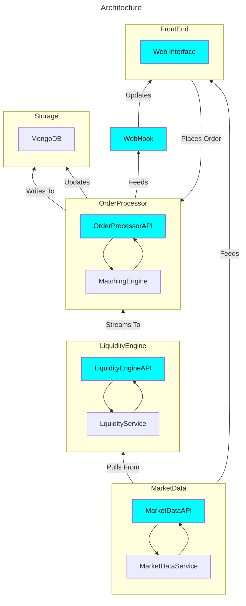

```mermaid
---
title: Architecture
---
graph BT;
   subgraph FrontEnd
       A[Web Interface]
   end


   subgraph OrderProcessor
       B[OrderProcessorAPI]
       C[MatchingEngine]
       B --> C
       C --> B
   end


   subgraph Storage
       E[MongoDB]
   end


   subgraph MarketData
       F[MarketDataAPI]
       G[MarketDataService]
       F --> G
       G --> F
   end


   subgraph LiquidityEngine
       K[LiquidityEngineAPI]
       L[LquidityService]
       K --> L
       L --> K
   end

   FrontEnd --> |Places Order| OrderProcessor
   OrderProcessor --> |Writes To| Storage
   OrderProcessor --> |Updates| Storage

   OrderProcessor --> |Feeds| WebHook
   WebHook --> |Updates| FrontEnd


   MarketData -->|Pulls From| LiquidityEngine
   MarketData --> |Feeds| FrontEnd


   LiquidityEngine --> |Streams To| OrderProcessor


   classDef cloud fill:#00FFFF,stroke:#00000,stroke-width:2px,color:#000000;
   class A,B,F,K,WebHook cloud;
```