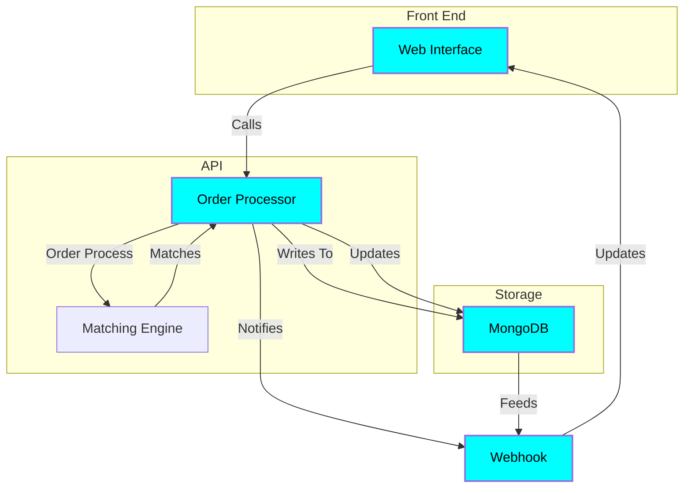

```mermaid
graph TD;
    subgraph "Front End"
        A[Web Interface]
    end

    subgraph API
        B[Order Processor]
        C[Matching Engine]
    end

    subgraph Storage
        D[MongoDB]
    end

    A -->|Calls| B
    B -->|Order Process| C
    C -->|Matches| B
    B -->|Writes To| D
    B -->|Updates| D
    B -->|Notifies| E[Webhook]

    D -->|Feeds| E
    E -->|Updates| A

    classDef cloud fill:#00FFFF,stroke:#00000,stroke-width:2px,color:#000000;
    class A,B,D,E cloud;

```
