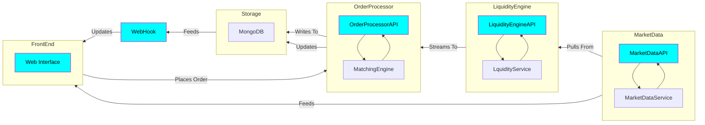

<<<<<<< HEAD

=======
graph TD;
    subgraph Front End
        A[Web Interface]
    end

    subgraph API
        B --> C[Matching Engine]
        C --> B[Order Processor]
    end

    subgraph Storage
        D[MongoDB]
    end

    A --> API
    API--> |Updates| Storage

    E[Webhook] --> |listens to| Storage
    A <--> |Updates From| E[Webhook]
    A --> |Writes To| Storage 
    

    classDef cloud fill:#00FFFF,stroke:#00000,stroke-width:2px,color:#000000;
    classDef listens fill:#90EE90,stroke:#333,stroke-width:2px, color: #000000;
    class A,B,D cloud;
    class E listens;
>>>>>>> 19c4542 (Add mermaid script for architecture diagram)
