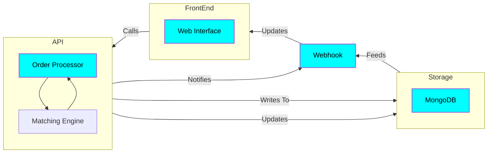

```mermaid
graph RL;
    subgraph FrontEnd
        A[Web Interface]
    end

    subgraph API
        B --> C[Matching Engine]
        C --> B[Order Processor]
    end

    subgraph Storage
        D[MongoDB]
    end
    
    
    FrontEnd-->|Calls| API
    Storage --> |Feeds| E
    E --> |Updates| FrontEnd
    
    API--> |Writes To| Storage
    API--> |Updates| Storage
    API --> |Notifies| E[Webhook]

    classDef cloud fill:#00FFFF,stroke:#00000,stroke-width:2px,color:#000000;
    class A,B,D,E cloud;
```
