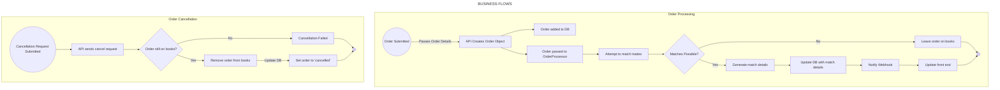

```mermaid
---
title: BUSINESS FLOWS
---
flowchart TD
    subgraph Order Processing
        %% Nodes
        A@{ shape: circle, label: "Order Submitted" }
        B["API Creates Order Object"]:::rect
        C["Order added to DB"]:::rect
        D["Order passed to OrderProcessor"]:::rect
        E["Attempt to match trades"]:::process
        F{"Matches Possible?"}
        G["Generate match details"]
        H["Leave order on books"]
        I["Update DB with match details"]
        J["Notify Webhook"]
        K["Update front end"]
        L@{ shape: framed-circle, label: "Stop" }


        %% Connections
        A --> |"Passes Order Details"| B
        B --> C
        B --> D
        D --> E
        E --> F
        F --> |No| H
        F --> |Yes| G
        G --> I 
        I --> J
        J --> K
        H --> L
        K --> L
    end

    subgraph Order Cancellation
        %% Nodes
        a@{ shape: circle, label: "Cancellation Request Submitted"}
        b["API sends cancel request"]
        c{"Order still on books?"}
        d["Cancellation Failed"]
        e["Remove order from books"]
        f["Set order to 'cancelled'"]
        g@{ shape: framed-circle, label: "Stop" }
        
        %% Connections
        a --> b 
        b --> c 
        c --> |"Yes"|e 
        c --> |"No"|d 
        d --> g 
        e --> |"Update DB"|f 
        f --> g
    end
```