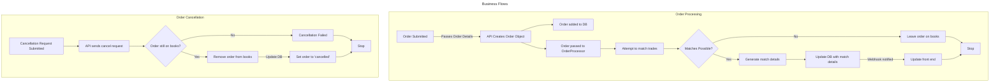

# Business Flows

```mermaid
---
title: Business Flows
---
flowchart TD
    subgraph Order Processing
        %% Nodes
        A["Order Submitted"]:::circle
        B["API Creates Order Object"]:::rect
        C["Order added to DB"]:::rect
        D["Order passed to OrderProcessor"]:::rect
        E["Attempt to match trades"]:::process
        F{"Matches Possible?"}:::decision
        G["Generate match details"]:::rect
        H["Leave order on books"]:::rect
        I["Update DB with match details"]:::rect
        K["Update front end"]:::rect
        L["Stop"]:::circle

        %% Connections
        A --> |"Passes Order Details"| B
        B --> C
        B --> D
        D --> E
        E --> F
        F --> |No| H
        F --> |Yes| G
        G --> I
        I --> |Webhook notified| K
        H --> L
        K --> L
    end

    subgraph Order Cancellation
        %% Nodes
        a["Cancellation Request Submitted"]:::circle
        b["API sends cancel request"]:::rect
        c{"Order still on books?"}:::decision
        d["Cancellation Failed"]:::rect
        e["Remove order from books"]:::rect
        f["Set order to 'cancelled'"]:::rect
        g["Stop"]:::circle

        %% Connections
        a --> b
        b --> c
        c --> |"Yes"| e
        c --> |"No"| d
        d --> g
        e --> |"Update DB"| f
        f --> g
    end
```
