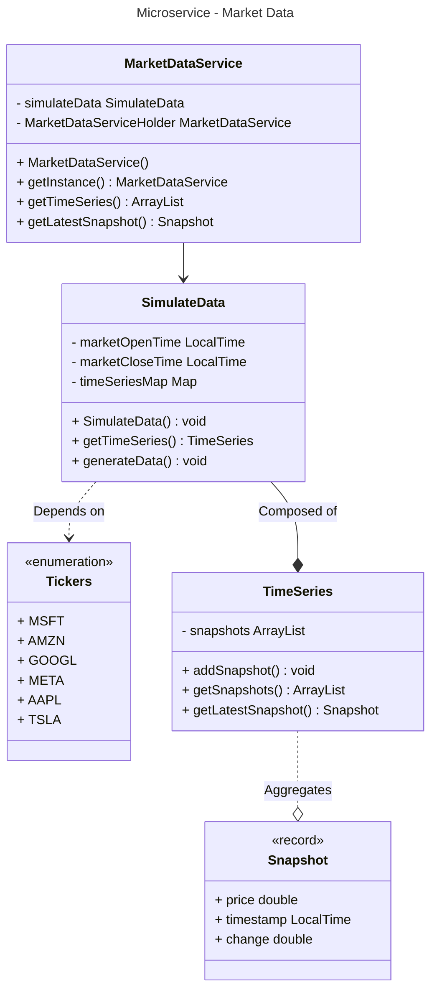

# Market Data

```mermaid
---
title: Microservice - Market Data
---
classDiagram
    %% Define classes
    class Tickers {
        <<enumeration>>
        + MSFT
        + AMZN
        + GOOGL
        + META
        + AAPL
        + TSLA
    }

    class TimeSeries {
        - snapshots ArrayList<Snapshot>
        + addSnapshot() void
        + getSnapshots() ArrayList<Snapshot>
        + getLatestSnapshot() Snapshot
    }

    class Snapshot {
        <<record>>
        + price double
        + timestamp LocalTime
        + change double
    }

    class SimulateData {
        - marketOpenTime LocalTime
        - marketCloseTime LocalTime
        - timeSeriesMap Map<Tickers, TimeSeries>
        + SimulateData() void
        + getTimeSeries() TimeSeries
        + generateData() void
    }

    class MarketDataService {
        - simulateData SimulateData
        - MarketDataServiceHolder MarketDataService
        + MarketDataService()
        + getInstance() MarketDataService
        + getTimeSeries() ArrayList<Snapshot>
        + getLatestSnapshot() Snapshot
    }

    %% Define Relations
    TimeSeries ..o Snapshot : Aggregates
    SimulateData --* TimeSeries : Composed of
    SimulateData ..> Tickers : Depends on
    MarketDataService --> SimulateData
```
